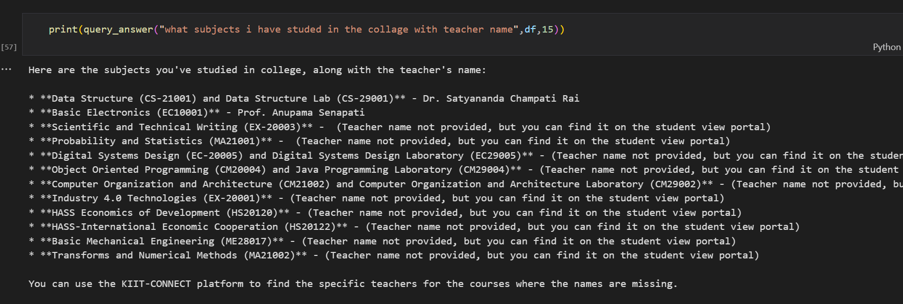
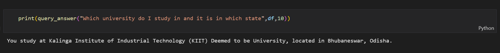

# Chatbot with Personal Email using RAG

This project implements a chatbot using **Retrieval-Augmented Generation (RAG)** with the **Gemini Pretrained Large Language Model (LLM)**. The chatbot answers email-related queries by retrieving relevant emails from a personal email dataset and generating accurate, context-aware responses.

## How It Works

1. **Email Vector Embedding**:
   - Each email in the dataset is converted into a **vector embedding** using a pre-trained model.
   
2. **Query Vector Embedding**:
   - When a user asks a question, the query is also converted into a **vector embedding**.

3. **Retrieving Relevant Emails**:
   - The chatbot calculates the **dot product** between the query vector and the email vectors to measure the similarity.
   - The system retrieves the **top 5 nearest emails** based on the calculated distances.

4. **Answer Generation**:
   - The retrieved email and user query are passed to the **Gemini LLM**.
   - The LLM uses a **custom prompt** to generate an accurate response based on the email's content and the user's question.

## Example of RAG Response

Below is an example of the chatbot retrieving relevant emails and generating a response:




> *This screenshot shows the chatbot using RAG to retrieve relevant emails from the dataset and answering the user's query with context.*

## Features

- **Gemini Pretrained LLM**: Utilizes Gemini's state-of-the-art language model to handle complex queries and generate human-like responses.
  
- **Custom Email Dataset**: The chatbot is designed to work with a personal email dataset, making the responses highly relevant to the user.

- **Vector Embedding for Emails and Queries**: The chatbot computes vector embeddings for both the emails and the user's question, enabling efficient similarity search and retrieval.

- **Dot Product Similarity**: Uses dot product to calculate the similarity between the query and email vectors, ensuring the most relevant emails are retrieved.

- **Top-5 Nearest Emails**: Retrieves the top 5 emails based on similarity scores, and feeds them along with a custom prompt to the LLM for generating the final response.

- **Contextual and Fluent Responses**: Combines retrieved email data and user queries to provide responses that are not only accurate but also contextually rich and fluent.

## Technologies Used

- **Gemini Pretrained Large Language Model (LLM)**: For natural language processing and answer generation.
- **Vector Embedding**: To represent emails and user queries as vectors for similarity search.
- **Dot Product Similarity**: For calculating distances between vector embeddings.
- **Python**: Used for model implementation and handling embeddings.
  
## Setup and Installation

1. **Clone the repository**:
   ```bash
   git clone https://github.com/your-username/Chatbot-with-Personal-Email-using-RAG.git
   cd Chatbot-with-Personal-Email-using-RAG
